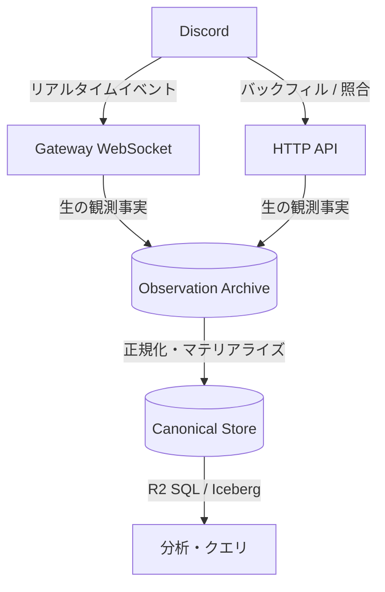
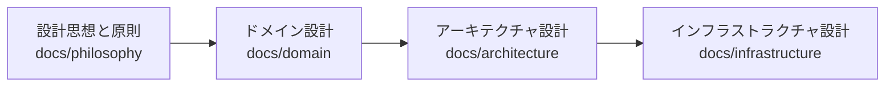

# OJIverse Data Warehouse

本プロジェクトは、Discord 上で観測された発言・活動を長期的に蓄積し、検索・集計・再処理を可能にする OJIverse のデータウェアハウス（DWH）を構築する。少なくとも 5〜10 年規模の運用を想定し、将来増えていく Bot / AI Agent が過去のコミュニティ活動を文脈として利用できる長期記憶基盤を目指す。

## プロジェクトの目的と目標

本プロジェクトの主目的は、Discord Gateway（WebSocket）および Discord HTTP API から取得した観測結果を安全に保存し、分析可能な Canonical Store へ変換するとともに、将来の Bot / AI Agent が個人を指定した過去発言を含むコミュニティ内の履歴を検索・参照・集計できる共通基盤を提供することである。

プロダクトとしての利用目的、認可、保持・削除、収集範囲、状態の意味論は [Product Policy](docs/domain/product-policy/README.md) を唯一の基準とする。

長期運用に耐えうるデータ基盤として、以下の要件を満たす設計とする。

* **切断を前提とした耐障害性**: Discord Gateway の一時的な切断や再接続を「異常」ではなく「日常的な事象」として扱い、セッションを安全に回復する。
* **HTTP Backfill による欠損回復と整合性維持**: Gateway で受信できなかった区間について、Discord 上に残存する状態を HTTP API から補完し、定期的な照合（アンチエントロピー）により best-known state の完全性を高める。観測できなかった履歴を捏造しない。
* **長期運用に耐える再処理性**: 5〜10年の運用中に Discord API や内部スキーマが変化した場合でも、生データから過去データを任意に再計算・再構築可能とする。
* **厳格な来歴管理（Provenance）**: データが「いつ」「どの経路（Gateway / Backfill）で」「どのセッションやリクエストで」取得されたかを記録し、データの信頼性を保証する。
* **抽象度の分離**: Discord DWH としての固有ロジック（ドメイン設計）を、実行基盤である Cloudflare 固有の設計から完全に分離する。

## 実装言語

本プロジェクトの既定実装言語は **Go** とする。

Canonical materializer、replay / rebuild、CLI、validation、portable batch processing、Cloudflare 外 Gateway collector 等は原則 Go で実装する。

Cloudflare Workers / Durable Objects の runtime API に密接に結合する component は **TypeScript** で実装する。言語統一だけを目的に Go / WebAssembly を Workers へ強制しない。

詳細は [Implementation Language Policy](docs/architecture/implementation-language.md) と ADR-0014 を参照する。

## 技術検証（#36 spike）の実行

Archive → iceberg-go → R2 Data Catalog → R2 SQL の閉ループ検証は `scripts/spike.sh loop` で実行する。R2 dev 環境の接続情報と secret は 1Password（ojilab account、vault `ojiverse-datawarehouse-dev`、item `cloudflare-r2-dwh-spike`）に置き、`spike/r2-dev.op.env` の `op://` 参照経由で注入する。secret をファイルや環境に平文で置かない。

```
op run --account ojilab --env-file spike/r2-dev.op.env -- scripts/spike.sh loop
```

実測記録と手順の詳細は [docs/architecture/cloudflare/processing/iceberg-spike-result.md](docs/architecture/cloudflare/processing/iceberg-spike-result.md) を参照する。

## 実装コード

* [workers/backfill](workers/backfill/README.md): HTTP Backfill API Worker、Backfill Channel Durable Object、Discord HTTP Budget Durable Object の TypeScript 実装（Issue #37）
* [contracts/observation-envelope/v1](contracts/observation-envelope/v1/README.md): Go / TypeScript 間で共有する Observation Envelope v1 の互換性 fixture

## データフロー



### 2層データアーキテクチャ

データの恒久性と分析の柔軟性を両立するため、ストレージを明確に2層へ分離する。

| ストレージ層 | 役割 | データ特性 | 耐久性と再構築 |
| :--- | :--- | :--- | :--- |
| **Observation Archive** | 観測事実の証跡（Source of Evidence） | 取得ペイロードを無加工で追記（Append-only）。重複を許容。 | 最優先で保護。本層が残存していれば全データを再導出可能。 |
| **Canonical Store** | 分析用の正規化表現（Analytical Model） | クエリや集計に最適化された表現。最新状態はプロジェクションとして導出。 | Observation Archive から任意のタイミングで再構築（Rebuild）可能。 |

## 設計文書の構成

設計文書はすべて [docs/README.md](docs/README.md) を起点として段階的に展開される。関心事に応じて以下のように体系化する。



* **設計思想と原則 (`docs/philosophy`)**: 開発姿勢、支配的要因の見極め、不変条件、事実源、型、不変性など、リポジトリ全体を貫く設計思想・原則と実践規律を定義する。
* **ドメイン設計 (`docs/domain`)**: Discord DWH としてのデータモデル、状態遷移、整合性保証、復旧規則を定義する（クラウド基盤の語彙は含まない）。
* **アーキテクチャ設計 (`docs/architecture`)**: ドメインの要求を、Cloudflare などのプラットフォーム上でどのように実現するかを定義する。
* **インフラストラクチャ設計 (`docs/infrastructure`)**: 実際に作成する Cloudflare リソース、環境分離、権限、コスト試算を定義する。

※ 設計上の意思決定の背景は [ADR](docs/adr/README.md) に、障害対応や手動運用の手順は [ランブック](docs/runbooks/README.md) にそれぞれ分離して記録する。

## 文書作成の原則

* **ディレクトリごとの README.md**: 全ディレクトリに概要と索引を兼ねた README.md を配置し、必要な粒度まで段階的に読み進められる構造（段階的開示）を維持する。
* **自然言語と Mermaid のみ**: 設計文書にはソースコード、設定ファイル、SQL、API レスポンスダンプを一切含めず、概念と構造の記述に集中する。
* **200行制限**: 各文書は最大200行以内とし、超過した場合は関心事を細分化して別文書へ分割する。

## 開発ロードマップ

1. **開発フェーズ（初期）**: HTTP Backfill を実装し、Observation Archive および Canonical Store へのデータ保存・変換パイプラインの正常性を検証する。
2. **ベータフェーズ**: Gateway 接続を断続的に利用し、リアルタイム観測、切断時の自動再接続（Resume）、および HTTP Backfill による欠損回復の連携を検証する。
3. **本番フェーズ**: Workers Paid を導入して Gateway 接続の常時運用へ移行し、安定稼働を確立する。
