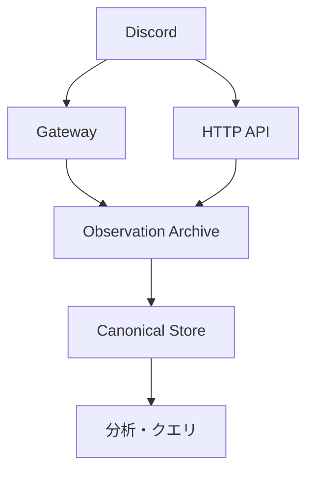

# OJIverse Data Warehouse

Discord 上で発生するデータを長期間蓄積し、後から検索・集計・再処理できるデータウェアハウスを構築するプロジェクトです。

## 目的

このプロジェクトでは、Discord Gateway と Discord HTTP API から得られる観測結果を保存し、分析可能な Canonical Store へ変換します。

主な目標は次のとおりです。

- Gateway の一時的な切断や再接続を通常事象として扱えること
- Gateway で取り逃したデータを HTTP Backfill により可能な限り回復できること
- 5〜10年の運用中に Discord API や内部スキーマが変化しても再処理できること
- 取得元、取得時刻、Backfill などの provenance を失わないこと
- Cloudflare を主要基盤として利用しつつ、Discord DWH としての設計を基盤固有の設計から分離すること

## データフロー

Observation Archive は Discord から実際に観測した情報を保持する source of evidence です。

Canonical Store は Observation Archive から再構築可能な、分析向けの正規化されたデータ表現です。

## 設計文書

設計文書は [docs/README.md](docs/README.md) を入口とします。

設計は大きく次の三つに分離します。

- **ドメイン設計**: Discord DWH としての意味、状態、保証、復旧規則
- **アーキテクチャ設計**: ドメイン設計を Cloudflare の能力と制約の下でどう実現するか
- **インフラストラクチャ設計**: 実際の Cloudflare リソース、環境、配置、権限、コスト

設計上の意思決定は ADR、障害対応などの運用手順はランブックに分離します。

## 文書作成原則

すべての設計ディレクトリは README.md を持ち、概要と索引を兼ねます。

設計文書は自然言語と Mermaid のみで記述します。実装コード、疑似コード、設定ファイル、SQL などは設計文書には含めません。

各文書は 200 行以内とし、200 行を超える場合は段階的開示に沿って設計上の関心事を分割します。

## 開発方針

初期段階では HTTP Backfill を利用し、Observation Archive と Canonical Store への保存が正しく動作することを検証します。

ベータ段階では Gateway 接続を断続的に利用し、Gateway 経由の観測、切断、再接続、Backfill による回復を検証します。

その後 Workers Paid へ移行し、Gateway を継続運用して安定稼働へ移行する計画です。

年内の安定稼働を目標とします。
