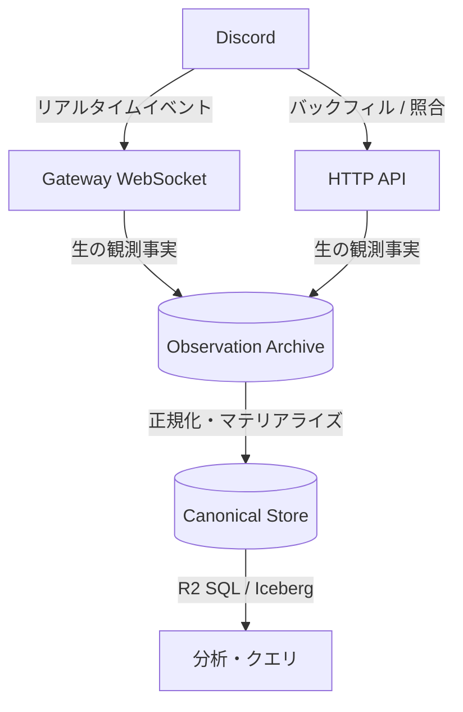
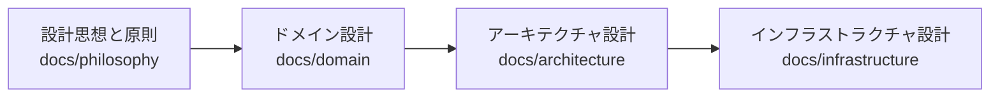

# OJIverse Data Warehouse

Discord 上で発生するイベントやメッセージを長期間（5〜10年）にわたって蓄積し、後から自在に検索・集計・再処理できるデータウェアハウス（DWH）を構築するプロジェクトです。

## プロジェクトの目的と目標

本プロジェクトは、Discord Gateway（WebSocket）および Discord HTTP API から取得した観測結果を安全に保存し、分析可能な Canonical Store へ変換・提供することを目的としています。

長期運用に耐えうるデータ基盤として、以下の要件を満たす設計としています。

* **切断を前提とした耐障害性**: Discord Gateway の一時的な切断や再接続を「異常」ではなく「日常的な事象」として扱い、セッションを安全に回復します。
* **HTTP Backfill による欠損回復と整合性維持**: Gateway で受信できなかった区間のデータを HTTP API から確実に補完し、定期的な照合（アンチエントロピー）によりデータの完全性を維持します。
* **長期運用に耐える再処理性**: 5〜10年の運用中に Discord API や内部スキーマが変化しても、生データからいつでも過去データを再計算・再構築できるようにします。
* **厳格な来歴管理（Provenance）**: データが「いつ」「どの経路（Gateway / Backfill）で」「どのセッションやリクエストで」取得されたかを記録し、データの信頼性を保証します。
* **抽象度の分離**: Discord DWH としての固有ロジック（ドメイン設計）を、実行基盤である Cloudflare 固有の設計から完全に分離します。

## データフロー

### 2層データアーキテクチャ

データの恒久性と分析の柔軟性を両立するため、ストレージを明確に2層へ分離しています。

| ストレージ層 | 役割 | データ特性 | 耐久性と再構築 |
| :--- | :--- | :--- | :--- |
| **Observation Archive** | 観測事実の証跡（Source of Evidence） | 取得ペイロードを無加工で追記（Append-only）。重複を許容。 | 最優先で保護。ここが残っていれば全データを再導出可能。 |
| **Canonical Store** | 分析用の正規化表現（Analytical Model） | クエリや集計に最適化された表現。最新状態はプロジェクションとして導出。 | Observation Archive からいつでも再構築（Rebuild）可能。 |

## 設計文書の構成

設計文書はすべて [docs/README.md](docs/README.md) を起点として段階的に展開されます。関心事に応じて以下のように体系化しています。

* **設計思想と原則 (`docs/philosophy`)**: 開発姿勢、課題の急所（支配的要因）の見極め、不変条件、事実源、型、不変性など、リポジトリ全体を貫く設計思想・原則と実践規律。
* **ドメイン設計 (`docs/domain`)**: Discord DWH としてのデータモデル、状態遷移、整合性保証、復旧規則を定義します（クラウド基盤の語彙は含みません）。
* **アーキテクチャ設計 (`docs/architecture`)**: ドメインの要求を、Cloudflare などのプラットフォーム上でどのように実現するかを定義します。
* **インフラストラクチャ設計 (`docs/infrastructure`)**: 実際に作成する Cloudflare リソース、環境分離、権限、コスト試算を定義します。

※ 設計上の意思決定の背景は [ADR](docs/adr/README.md) に、障害対応や手動運用の手順は [ランブック](docs/runbooks/README.md) にそれぞれ分離しています。

## 文書作成の原則

* **ディレクトリごとの README.md**: 全ディレクトリに概要と索引を兼ねた README.md を配置し、必要な粒度まで段階的に読み進められる構造（段階的開示）を保ちます。
* **自然言語と Mermaid のみ**: 設計文書にはソースコード、設定ファイル、SQL、API レスポンスダンプを一切含めず、概念と構造の記述に集中します。
* **200行制限**: 各文書は最大200行以内とし、超過した場合は関心事を細分化して別文書へ分割します。

## 開発ロードマップ

1. **開発フェーズ（初期）**: HTTP Backfill を実装し、Observation Archive および Canonical Store へのデータ保存・変換パイプラインの正常性を検証します。
2. **ベータフェーズ**: Gateway 接続を断続的に利用し、リアルタイム観測、切断時の自動再接続（Resume）、および HTTP Backfill による欠損回復の連携を検証します。
3. **本番フェーズ**: Workers Paid を導入して Gateway 接続の常時運用へ移行し、年内の安定稼働を目指します。
