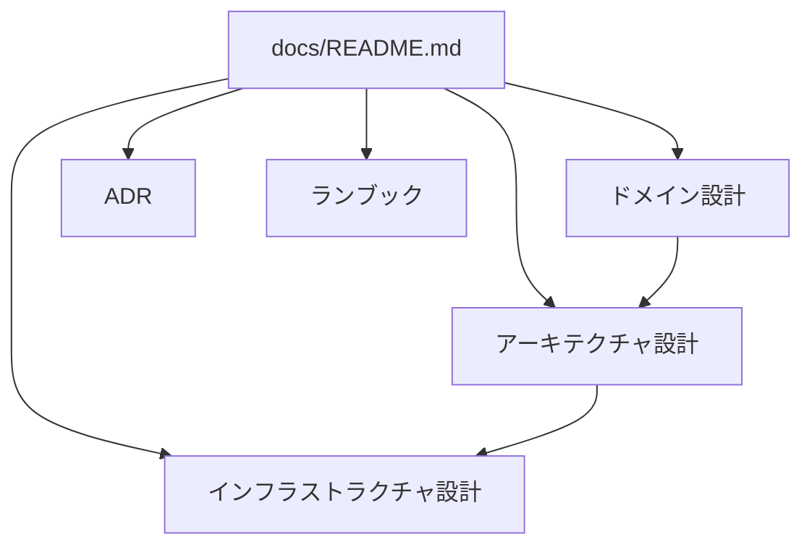
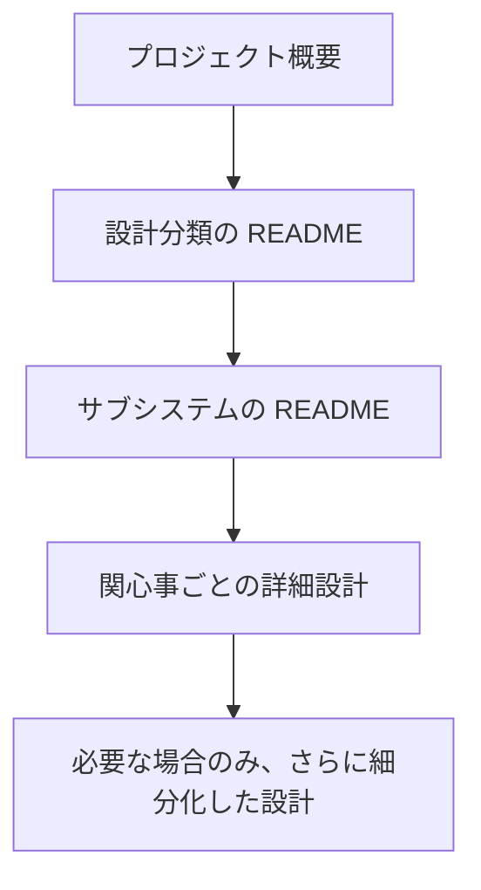
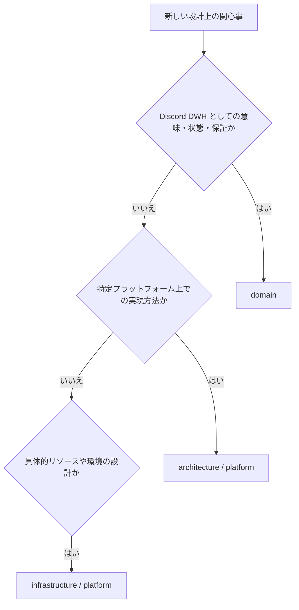

# 設計文書

このディレクトリは OJIverse Data Warehouse の設計文書の入口です。

## 文書体系

設計は、Discord DWH としての意味から具体的な Cloudflare リソースまでを段階的に開示します。

### ドメイン設計

[domain/README.md](domain/README.md) を入口とします。

Discord 向け DWH として、何を観測し、どう解釈し、どのような状態・整合性・復旧・履歴を保証するかを定義します。

Discord の概念や Gateway、HTTP API の仕様はドメイン設計に含めて構いません。

Cloudflare 固有のサービスや実現手段は原則として含めません。ただし実際の基盤制約を踏まえてドメイン要件が調整されることは許容します。その場合もベンダー固有の仕組みではなく、DWH が満たすべき制約や保証として表現します。

### アーキテクチャ設計

[architecture/README.md](architecture/README.md) を入口とします。

ドメイン設計を特定のプラットフォームの能力と制約の下でどう成立させるかを定義します。

現在の主要プラットフォームは Cloudflare であり、Cloudflare 固有の設計は [architecture/cloudflare/README.md](architecture/cloudflare/README.md) 以下に配置します。

### インフラストラクチャ設計

[infrastructure/README.md](infrastructure/README.md) を入口とします。

実際に作成・管理するリソース、環境、binding、permission、deployment topology、quota、cost などを扱います。

Cloudflare のインフラストラクチャ設計は [infrastructure/cloudflare/README.md](infrastructure/cloudflare/README.md) 以下に配置します。

### ADR

[adr/README.md](adr/README.md) に設計判断の履歴を記録します。

設計文書は「現在どうなっているか」を説明し、ADR は「なぜその判断をしたか」を説明します。

### ランブック

[runbooks/README.md](runbooks/README.md) に運用手順を配置します。

障害対応、手動 Backfill、再構築など、具体的な操作手順は設計文書から分離します。

## 段階的開示

すべてのディレクトリは必ず README.md を持ちます。

README.md は、そのディレクトリの概要と索引を兼ねます。

読者は次の順序で必要な範囲までだけ読み進められる状態を維持します。

README.md に詳細設計を詰め込みません。

詳細が増えた場合は配下の文書へ分割し、README.md から案内します。

## 文書形式

設計文書は自然言語と Mermaid のみで記述します。

Markdown の見出し、段落、リスト、表、リンクは自然言語の構造化表現として使用できます。

設計文書にはソースコード、疑似コード、JSON、YAML、TOML、SQL、Shell script、Terraform、Wrangler configuration、API response dump を記載しません。

実装例が必要な場合は source、test、fixture、example など、設計文書とは別の場所に置きます。

## 200 行制限

すべての設計文書は 200 行以内とします。

見出し、空行、Mermaid を含む物理行数を数えます。

200 行を超える設計は文章を圧縮して収めるのではなく、段階的開示に従って関心事を分割します。

200 行を超えたこと自体を、設計の分割粒度が粗すぎるシグナルとして扱います。

## 設計分類の判断

新しい設計上の関心事は、次の観点で配置先を決定します。

一つの文書が複数分類にまたがる場合は、可能な限り別文書へ分離します。

## 現在の状態

この文書群は初期設計段階です。

現時点で合意済みの境界と責務を固定し、詳細設計は実装フェーズに合わせて段階的に追加します。
