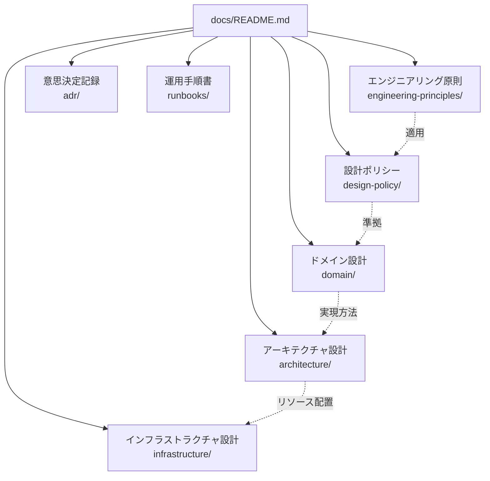
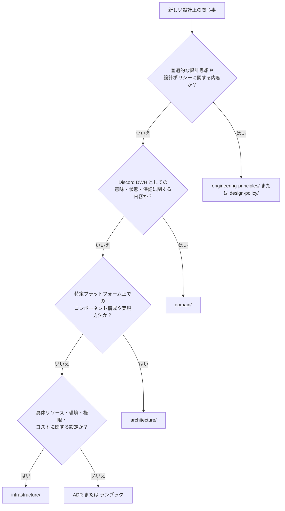

# 設計文書体系

このディレクトリは、OJIverse Data Warehouse の設計文書群の総合エントリポイントです。

本プロジェクトでは、Discord DWH としての概念定義から具体的な Cloudflare リソースの構成までを段階的に開示（Progressive Disclosure）し、将来のプラットフォーム移行や長期運用に耐えうる文書構造を採用しています。

## 文書体系と関心事の分離

設計文書は、抽象度と関心事に応じて以下の分類で体系化しています。

| 分類 | 格納ディレクトリ | 主な責務と対象 | クラウド固有情報の扱い |
| :--- | :--- | :--- | :--- |
| **エンジニアリング原則** | [engineering-principles/](engineering-principles/README.md) | 不変条件、事実源、型、不変性など、長期運用に耐えうる普遍的な設計原則 | **完全非依存**（アーキテクチャ思考の共通基盤） |
| **設計ポリシー** | [design-policy/](design-policy/README.md) | 原則をデータソース追加や「現在の確実性レベル」に適用した具体的ポリシー | **完全非依存**（設計チェックリストを提供） |
| **ドメイン設計** | [domain/](domain/README.md) | Discord DWH の意味論、エンティティ定義、データ整合性、復旧規則 | **原則禁止**（特定インフラに依存しない不変の要求を記述） |
| **アーキテクチャ設計** | [architecture/](architecture/README.md) | ドメイン要求を Cloudflare の能力・制約下で実現するコンポーネント構成 | **採用技術の方針のみ**（Worker, Durable Objects, R2 などの責務分担） |
| **インフラストラクチャ設計** | [infrastructure/](infrastructure/README.md) | 実際のリソース定義、環境分離、バインディング、権限、コスト試算 | **完全許容**（Cloudflare の具体的な設定や制限値を詳細化） |
| **ADR** | [adr/](adr/README.md) | 設計上の重要な意思決定の背景、比較検討した選択肢、採用理由の履歴 | 設計文書が「現在の姿」を示すのに対し、「なぜそうなったか」を記録 |
| **ランブック** | [runbooks/](runbooks/README.md) | 障害検知時の確認手順、手動リカバリ、データ再構築などの定型運用手順 | 具体的なトラブルシューティング手順を設計文書から隔離して記述 |

## 設計分類の判断基準

新しい関心事や要件を追加する際は、以下のフローに従って適切なディレクトリへ配置します。1つの文書に複数分類の内容が混ざる場合は、可能な限り文書を分割します。

## 文書作成の基本原則

本プロジェクトの設計文書は、保守性と可読性を長期にわたって維持するため、以下の厳格な規約に従って記述されます。

### 1. 段階的開示（Progressive Disclosure）
すべてのディレクトリには必ず `README.md` を配置し、概要と配下ドキュメントへの案内（インデックス）を兼ねます。
読者は「プロジェクト概要 → 各領域の README → サブシステムの README → 関心事ごとの詳細設計」の順に、必要な深度まで迷わず読み進められる構造を維持します。README に過剰な詳細を詰め込まず、詳細化が必要になった段階で子文書へ分割します。

### 2. 自然言語と Mermaid のみの採用
設計文書にはソースコード、疑似コード、JSON/YAML、SQL、設定ファイル（Wrangler / Terraform 等）、API レスポンスダンプを一切記載しません。
実装詳細を含めると、コードの変更に伴って設計書が容易に陳腐化し、設計の本質的な意図が埋もれてしまうためです。コード例や設定サンプルが必要な場合は、リポジトリ内のソースコードやテストフィクスチャに配置します。

### 3. 200行制限による分割の強制
すべての設計文書は、空行や図表を含めて**最大200行以内**とします。
200行を超える分量になった場合は、文章を無理に圧縮するのではなく、設計の粒度が粗すぎるシグナルと捉え、段階的開示に従って新しいサブディレクトリや別ファイルへ関心事を分割します。

## 設計ドキュメントの現状

本ドキュメント群は「初期設計（境界と責務の合意）」フェーズにあります。
現時点では各領域の責務境界と基本方針を固定しており、開発の進行（HTTP Backfill の実装、Gateway の PoC）に合わせて各 README に記載された「今後分割する詳細設計」を順次追加していきます。
