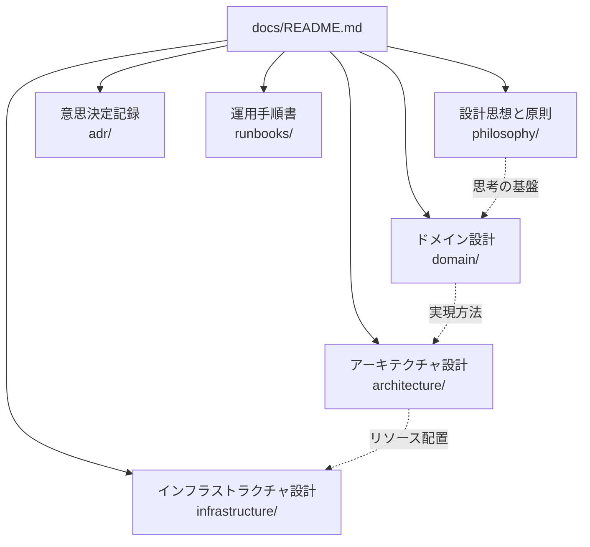
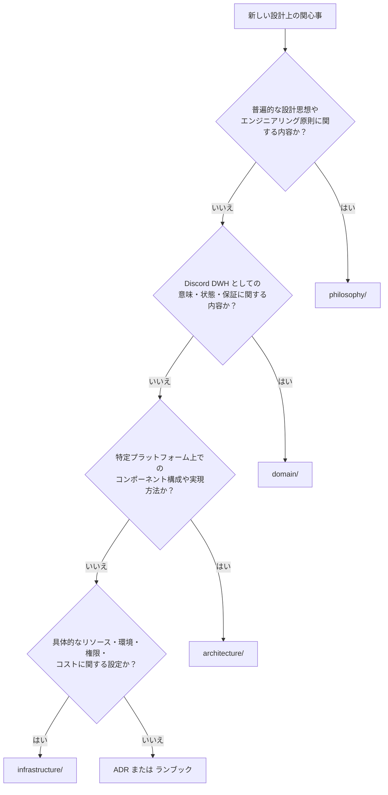

# 設計文書体系

本ディレクトリは、OJIverse Data Warehouse の設計文書群における総合エントリポイントを定義する。

本プロジェクトでは、設計思想から Discord DWH としての概念定義、および具体的な Cloudflare リソース構成に至るまでを段階的に開示（Progressive Disclosure）し、将来のプラットフォーム移行や長期運用に耐えうる文書構造を採用する。

## 文書体系と関心事の分離

設計文書は、抽象度と関心事に応じて以下の分類により体系化される。

| 分類 | 格納ディレクトリ | 主な責務と対象 | クラウド固有情報の扱い |
| :--- | :--- | :--- | :--- |
| **設計思想と原則** | [philosophy/](philosophy/README.md) | 開発姿勢、課題解決の急所（支配的要因）、不変条件、事実源、型、不変性、設計ポリシー | **完全非依存**（アーキテクチャと思考の共通基盤） |
| **ドメイン設計** | [domain/](domain/README.md) | Discord DWH の意味論、エンティティ定義、データ整合性、復旧規則 | **原則禁止**（特定インフラに依存しない不変の要求を記述） |
| **アーキテクチャ設計** | [architecture/](architecture/README.md) | ドメイン要求を Cloudflare の能力・制約下で実現するコンポーネント構成 | **採用技術の方針のみ**（Worker, Durable Objects, R2 などの責務分担） |
| **インフラストラクチャ設計** | [infrastructure/](infrastructure/README.md) | 実際のリソース定義、環境分離、バインディング、権限、コスト試算 | **完全許容**（Cloudflare の具体的な設定や制限値を詳細化） |
| **ADR** | [adr/](adr/README.md) | 設計上の重要な意思決定の背景、比較検討した選択肢、採用理由の履歴 | 設計文書が「現在の姿」を示すのに対し、「なぜそうなったか」を記録 |
| **ランブック** | [runbooks/](runbooks/README.md) | 障害検知時の確認手順、手動リカバリ、データ再構築などの定型運用手順 | 具体的なトラブルシューティング手順を設計文書から隔離して記述 |

## 設計分類の判断基準

新しい関心事や要件を追加する際は、以下の判定フローに従って適切なディレクトリへ配置する。1つの文書に複数分類の内容が混在する場合は、関心事ごとに文書を分割する。

## 文書作成の基本原則

設計文書の長期的な保守性と可読性を維持するため、以下の規約を遵守して記述する。

### 1. 段階的開示（Progressive Disclosure）
すべてのディレクトリには必ず `README.md` を配置し、概要と配下ドキュメントへの案内（インデックス）を兼ねる構造とする。
読者が「プロジェクト概要 → 各領域の README → サブシステムの README → 関心事ごとの詳細設計」の順に、必要な深度まで迷わず辿れる構造を維持する。README への過剰な詳細記述を避け、詳細化が必要になった段階で子文書へ分割する。

### 2. 自然言語と Mermaid のみの採用
設計文書にはソースコード、疑似コード、JSON/YAML、SQL、設定ファイル（Wrangler / Terraform 等）、API レスポンスダンプの記載を一切禁じる。
実装詳細の混入はコード変更に伴う文書の陳腐化を招き、設計の本質的意図を損なうためである。実装例や設定サンプルは、リポジトリ内のソースコードまたはテストフィクスチャとして管理する。

### 3. 200行制限による分割の強制
すべての設計文書は、空行や図表を含めて**最大200行以内**とする。
200行を超過した場合は、記述の圧縮ではなく設計粒度の粗さを示すシグナルと判定し、段階的開示の原則に従って新しいサブディレクトリまたは別ファイルへ関心事を分割する。

## 設計ドキュメントの現状

本ドキュメント群は「初期設計（境界と責務の合意）」フェーズに位置づけられる。
現時点では各領域の責務境界および基本方針を固定しており、開発の進捗（HTTP Backfill の実装、Gateway の検証）に伴い、各 README に規定された「今後分割する詳細設計」を順次追加する。
