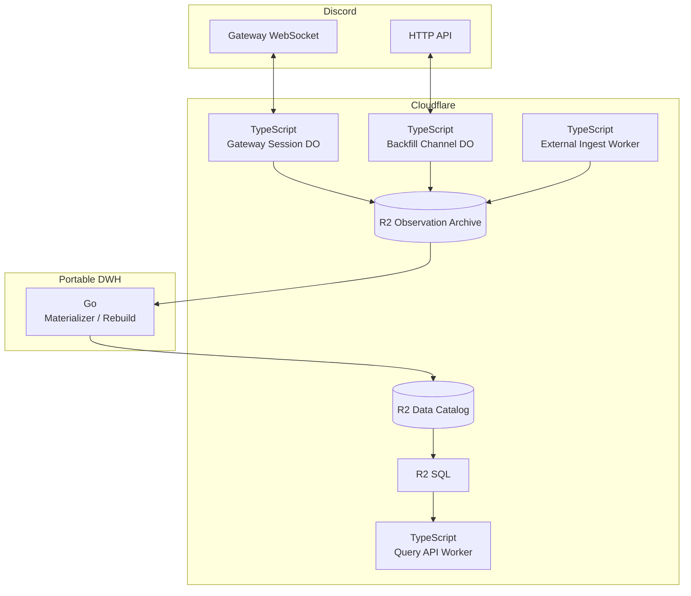

# Cloudflare アーキテクチャ

本ディレクトリでは、Discord DWH のドメイン要件を Cloudflare の分散エッジプラットフォーム上で実現するためのアプリケーションアーキテクチャを定義する。

実装言語は [Implementation Language Policy](../implementation-language.md) に従い、Cloudflare Workers / Durable Objects の native adapter は TypeScript、portable DWH logic は Go を既定とする。

## 全体コンポーネント構成

Observation Archive への durable write path に Cloudflare Queues を置かない。

Queues、R2 Event Notifications、Pipelines 等は、将来 Canonical freshness を改善する optional trigger として追加できるが、Source of Evidence や rebuild correctness の前提にしない。

## サブシステム一覧

* [ingestion/](ingestion/README.md): TypeScript Durable Objects による Gateway Session ownership、Resume、Identify coordination
* [observations/](observations/README.md): producer から R2 Observation Archive への direct write path
* [canonical-store/](canonical-store/README.md): Apache Iceberg / R2 Data Catalog による Canonical Store
* [backfill/](backfill/README.md): TypeScript Durable Objects による HTTP Backfill と durable progress
* [processing/](processing/README.md): Go-first materializer、replay、full rebuild
* [operations/](operations/README.md): failure detection、verification、Production Readiness

## アーキテクチャ設計原則

1. **Durability First**: Observation Archive write を Canonical processing の成否に依存させない。
2. **Direct Archive Commit**: HTTP / Gateway producer は R2 commit を Durable Acceptance とし、Queue retention を durability boundary にしない。
3. **Portability Boundary**: portable DWH logic は Go、Cloudflare native adapter は TypeScript に限定する。
4. **Derived Canonical**: Canonical Store は Observation Archive から rebuild 可能でなければならない。
5. **Optional Acceleration**: Queue / Pipelines 等の追加 mechanism は correctness ではなく latency / cost optimization として導入する。
