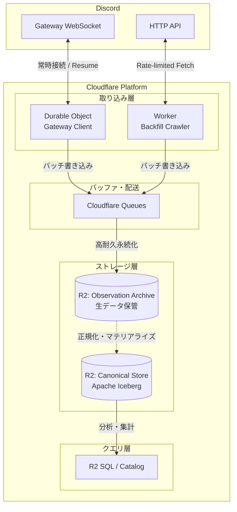

# Cloudflare アーキテクチャ

本ディレクトリでは、Discord DWH のドメイン要件を Cloudflare の分散エッジプラットフォーム上で実現するためのアプリケーションアーキテクチャを定義します。

## 全体コンポーネント構成

Cloudflare の提供するサーバーレスランタイム、ステートフルオブジェクト、キュー、およびオブジェクトストレージを組み合わせ、高耐久かつ疎結合なパイプラインを構成します。

## サブシステム一覧

* [ingestion/](ingestion/README.md): Durable Objects を用いた Gateway 常時接続、セッション維持、およびイベント引き渡し
* [observations/](observations/README.md): Cloudflare Queues と R2 を連携させた、Observation Archive の高耐久書き込みパス
* [canonical-store/](canonical-store/README.md): R2 上の Apache Iceberg テーブルおよび R2 Data Catalog による分析モデルの実体化
* [backfill/](backfill/README.md): Workers と Queues を利用した、レート制限追従型の HTTP クロールとアンチエントロピー照合
* [processing/](processing/README.md): 生データの正規化、重複排除、および過去ログのリプレイ・再構築パイプライン
* [operations/](operations/README.md): 死活監視、切断検知、データ完全性検証、および本番移行に向けた運用設計

## アーキテクチャ設計原則

1. **耐久性の独立（Durability First）**: Observation Archive への生データ書き込みの成否を、Canonical Store の正規化処理の成否に依存させてはなりません。正規化処理が停止・失敗しても、生ログは R2 に安全に蓄積され続ける構成を死守します。
2. **手段と目的の分離**: Durable Objects や Queues、Pipelines などの Cloudflare 機能はドメイン要件を満たすための実装手段であり、プラットフォーム側の仕様変更が生じた場合でもドメインロジックへの影響を局所化します。
3. **コストと耐久性の調和**: エッジワーカーでの無秩序な R2 PUT リクエストの乱発を避け、Queues によるバッチ集約を挟むことで、R2 の Class A 操作コストを適切に抑制します。
