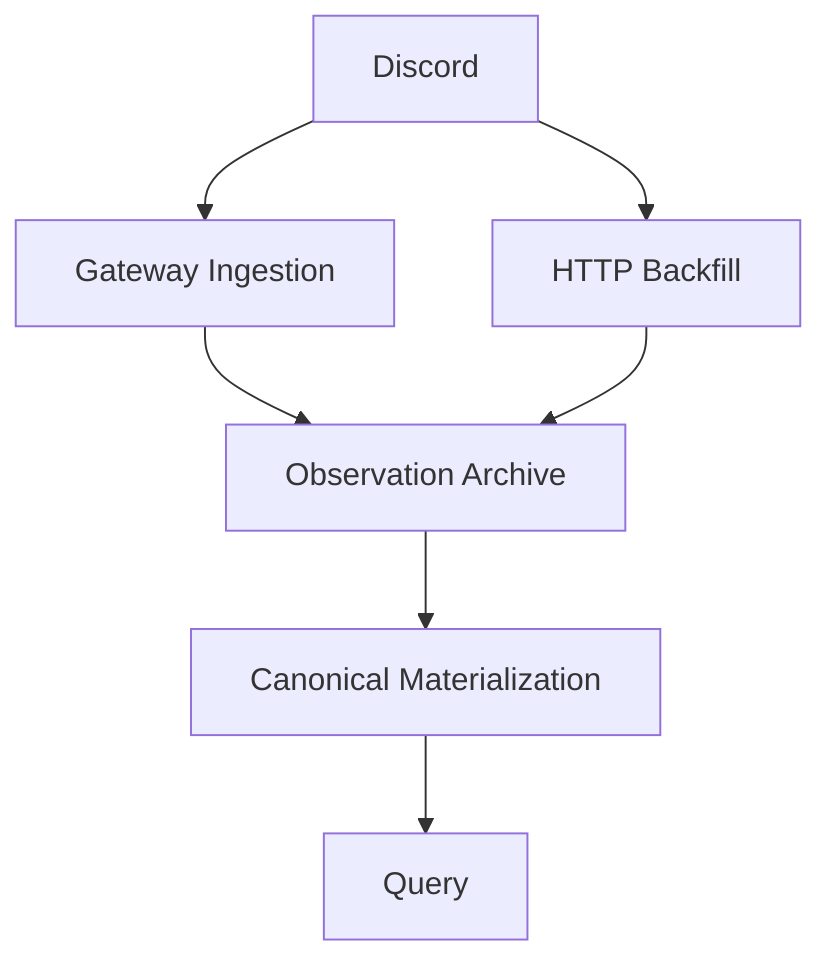

# Cloudflare Architecture

Discord DWH の Domain Design を Cloudflare 上で実現する application architecture を扱います。

## 全体像

現時点では次の capability を主要候補として扱います。

具体的な Cloudflare resource 名や environment ごとの構成は Infrastructure Design で扱います。

## Subsystem

- [ingestion/README.md](ingestion/README.md): Gateway の継続接続、session state、delivery
- [observations/README.md](observations/README.md): Observation Archive への durable write path
- [canonical-store/README.md](canonical-store/README.md): Canonical Data の materialization と query path
- [backfill/README.md](backfill/README.md): HTTP Backfill の execution model
- [processing/README.md](processing/README.md): normalization、replay、rebuild
- [operations/README.md](operations/README.md): failure detection、verification、production readiness

## 設計原則

Observation Archive の durability を Canonical materialization の成功に依存させません。

Cloudflare 固有機能は Domain requirement を実現する手段として扱い、Domain の意味そのものと混同しません。

Beta や production の具体的な environment 構成は Infrastructure Design に置きます。
