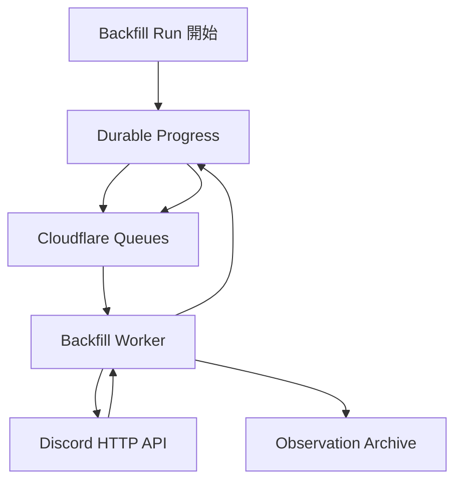

# Cloudflare Backfill アーキテクチャ

本ディレクトリでは、Discord HTTP API を利用して過去ログや欠損区間のデータを巡回取得する Backfill エンジンを、Cloudflare 上で成立させるアーキテクチャを定義する。

## Queue と Durable Progress の責務分離

Backfill は Cloudflare Queues を利用してページ単位の処理を非同期実行できる。

ただし Queue message は一時的な execution trigger であり、Backfill run の進行状態の唯一の事実源にはしない。

各 run は、中断後に復元可能な durable progress ledger を持つ。

Worker は durable progress から取得対象と現在位置を確認し、1つの処理単位を実行する。

取得結果を Observation Archive へ引き渡した後、durable progress を更新する。

Queue message が expiry、retry、consumer restart 等で失われても、未完了 run を durable progress から再発見し、再度実行できる構成とする。

## Progress Storage

Durable progress を D1 に置くことは必須としない。

Durable Objects Storage、R2 上の run manifest、その他の Cloudflare capability を候補として、更新頻度、競合制御、復旧性、コストを比較して決定する。

具体的な storage mechanism が未確定でも、Queue だけを progress authority にしないことは確定要件とする。

## Discord Rate Limit への追従

Discord HTTP API の rate limit は固定値をハードコードした pacing だけに依存せず、Discord から得られる rate-limit information に従って実行を調整する。

Rate limit による一時停止中も durable progress を失わず、再開時に同じ run を継続できることを保証する。

## 定期照合

Reconciliation の定期起動には Cloudflare の scheduling capability を利用する。

定期照合は既存の Backfill execution path を再利用するが、長期間の Cold Start run の durable progress を代替しない。

## 分割予定の詳細設計

* **Backfill Execution**: run の開始、処理、完了の状態遷移
* **Durable Progress Ledger**: progress authority と更新境界
* **Pagination Continuation**: ページネーション終了判定と次の取得位置
* **Rate Limit Handling**: retry、backoff、rate-limit coordination
* **Reconciliation Scheduling**: 定期照合の起動と対象範囲
* **Backfill Recovery**: Queue message 消失や runtime restart からの再開
