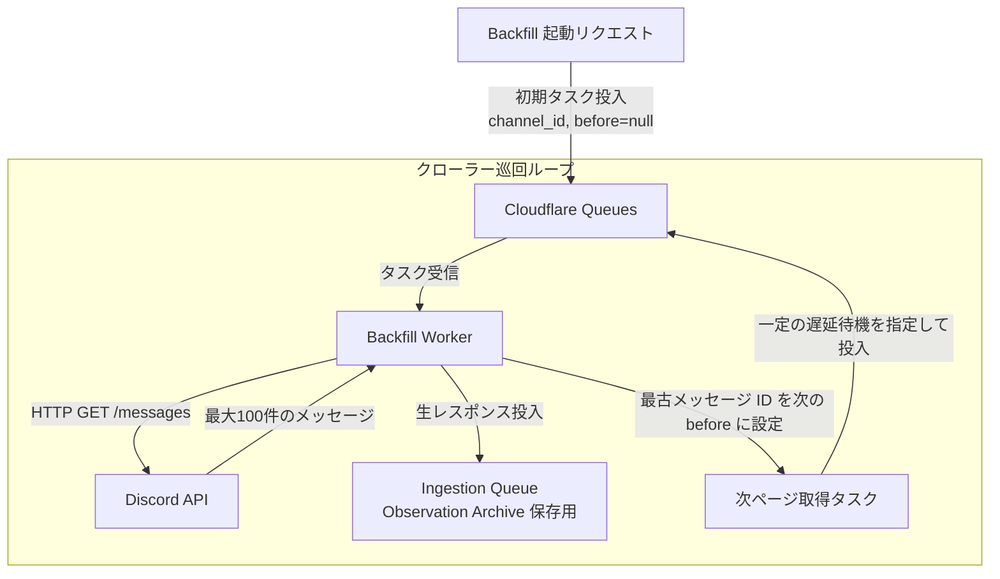

# Cloudflare Backfill アーキテクチャ

本ディレクトリでは、Discord HTTP API を利用して過去ログや欠損区間のデータを安全・確実に巡回取得する Backfill エンジンを、Cloudflare のサーバーレス環境上で成立させるアーキテクチャを扱います。

## ステートレスな進行管理とメッセージ連鎖（Chaining）

Discord のメッセージ取得 API（`/channels/{channel_id}/messages`）は、1 回のリクエストで最大 100 件までしか取得できず、数万件以上の履歴を遡るにはページネーション（`before` パラメータによるカーソル移動）を繰り返す必要があります。

一般的なシステムでは進行状況（どのチャンネルのどこまで取得したか）を RDB に記録しがちですが、本アーキテクチャでは **D1 などのミュータブル DB を必須としません**。
Cloudflare Queues の遅延配信とメッセージ連鎖（Chaining）を組み合わせることで、ステートレスかつ耐障害性の高いクローラーを実現します。

* **キューメッセージ自体がカーソル（Continuation State）を保持**: キューのメッセージペイロードに `channel_id`、`before`（取得基準となる最古の Snowflake ID）、および `run_id` を持たせます。
* **自己継続（Chaining）による実行**: Worker は 1 ページ分を取得して Observation 保存キューへ流した後、取得した最古のメッセージ ID を次の `before` に設定したメッセージを再度キューへ投入（連鎖）します。
* **実行時間制限の回避**: 1 回の Worker 実行は 1 ページ（数十ミリ秒〜数秒）で完了するため、サーバーレス関数のタイムアウト制限に引っかかることなく、数百万件規模の過去ログを長期間かけて安全にクロールできます。

## Discord レート制限（Rate Limit）への協調

Discord API はエンドポイントごとに厳しいリクエスト制限（例: 50 requests/sec、チャンネル単位の制限）を設けており、超過時には HTTP 429 とともに `Retry-After` ヘッダーを返します。

* **キューの遅延投入（Delay Delivery）**: 次ページ取得メッセージをキューに再投入する際、レート制限に配慮したインターバル（Delay Seconds）を設定して急激なスパイクを抑止します。
* **HTTP 429 ハンドリング**: レート制限に遭遇した場合は、レスポンスの `Retry-After` 秒数を待機時間として指定し、同一タスクをキューへ再投入して安全に一時停止・再開します。

## 定期照合（Reconciliation）のスケジューリング

アンチエントロピー照合は、**Cloudflare Workers Cron Triggers** を利用して定期的に起動します。
定期起動 Worker は、監視対象チャンネルの「直近 N 時間のメッセージ取得タスク」を生成してキューへ投入し、既存の Backfill パイプラインをそのまま流用して差分を回収します。

## 今後分割する詳細設計

* **Backfill Execution**: キュー駆動型クロールエンジンの詳細ステートマシン
* **Pagination Continuation**: ページネーション終了判定（最古到達、または既取得 Snowflake との重複検知）
* **Rate Limit Handling**: エラーハンドリング、バックオフ係数、およびグローバルレート制限の制御
* **Reconciliation Scheduling**: Cron スケジュールと巡回対象チャンネルの決定ルール
