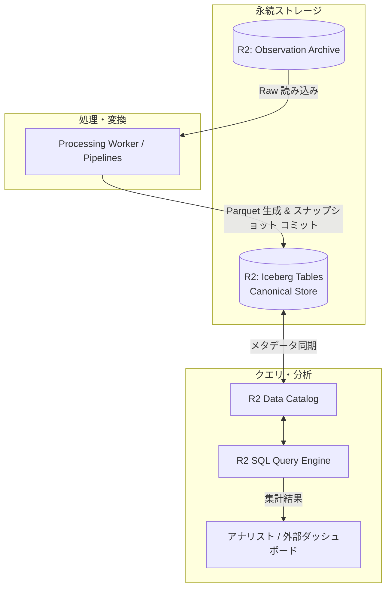

# Cloudflare Canonical Store アーキテクチャ

本ディレクトリでは、Observation Archive に蓄積された生データを、クエリおよび大規模集計に最適化された分析モデルへと変換・実体化（Materialization）し、Cloudflare 上で高速に問い合わせ可能にするアーキテクチャを定義する。

## Apache Iceberg と Cloudflare Data Platform の採用

Canonical Store の物理ストレージ基盤には、**R2 上の Apache Iceberg テーブル**を採用し、メタデータ管理およびクエリ層として **R2 Data Catalog** と **R2 SQL** を組み合わせる構成を中核とする。

| 採用技術 | 役割と選定理由 |
| :--- | :--- |
| **Apache Iceberg** | オープンなテーブルフォーマット。隠蔽パーティショニング、ACID トランザクション、タイムトラベル、およびスキーマ進化（列の追加・変更・削除）をストレージレベルで安全に実現可能。 |
| **R2 Data Catalog** | Iceberg の REST カタログとして機能し、テーブルのメタデータスナップショットを一元管理する。商用 DWH 製品への依存を排除。 |
| **R2 SQL** | R2 上の Iceberg テーブルに対してサーバーレスに分散 SQL クエリを実行し、結果を直接取得する。 |

## データマテリアライズとクエリパス

* **Observation からのマテリアライズ**: 到達した Observation バッチを正規化し、Parquet データファイルとして R2 へ配置した上で、Iceberg カタログに新規スナップショットとしてアトミックにコミットする。
* **クエリパスの最適化**: 分析クエリは、Iceberg のパーティションプルーニングや統計情報（min/max 値等）を活用して必要なデータファイルのみを走査（Scan）し、R2 SQL による低レイテンシかつ低コストなクエリを実行する。

## スキーマ進化と全再構築（Rebuild）の実現

5〜10年の運用において Canonical スキーマの構造変更が必要となった場合、以下の 2 アプローチを適用する。

1. **インプレースなスキーマ進化**: 列追加や型拡張など、Iceberg が標準サポートする後方互換な変更は、既存データの再生成を伴わずカタログのメタデータ更新のみで適用する。
2. **ゼロベースの全再構築（Rebuild）**: 導出ロジック自体の根本的改修が必要な場合は、新規バージョンの Iceberg テーブルを並行作成し、Observation Archive の全生ログを初めからリプレイしてデータを生成した後、カタログ参照先をアトミックに切り替える。

## 分割予定の詳細設計

* **Canonical Materialization**: Workers / Pipelines から Iceberg へのデータ書き出しとカタログコミット手順
* **Iceberg Mapping**: Message、Channel、Thread の各エンティティと Iceberg テーブルスキーマの対応
* **Query Runtime**: R2 SQL を利用した標準クエリパターンとパーティショニング設計
* **Rebuild Architecture**: 大規模再計算時における並列処理ワーカーの分散実行とカタログ切り替え
