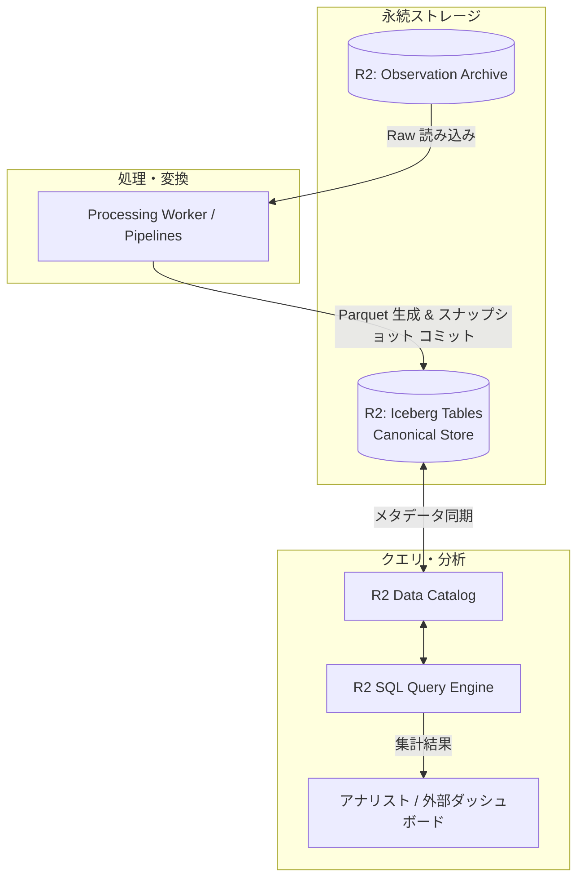

# Cloudflare Canonical Store アーキテクチャ

本ディレクトリでは、Observation Archive に蓄積された生データを、クエリおよび大規模集計に最適化された分析モデルへと変換・実体化（Materialization）し、Cloudflare 上で高速に問い合わせ可能にするアーキテクチャを定義する。

## Apache Iceberg と Cloudflare Data Platform の採用

Canonical Store の物理ストレージ基盤には、**R2 上の Apache Iceberg テーブル**を採用し、メタデータ管理およびクエリ層として **R2 Data Catalog** と **R2 SQL** を組み合わせる構成を中核とする。

| 採用技術 | 役割と選定理由 |
| :--- | :--- |
| **Apache Iceberg** | オープンなテーブルフォーマット。隠蔽パーティショニング、ACID トランザクション、タイムトラベル、およびスキーマ進化（列の追加・変更・削除）をストレージレベルで安全に実現可能。 |
| **R2 Data Catalog** | Iceberg の REST カタログとして機能し、テーブルのメタデータスナップショットを一元管理する。商用 DWH 製品への依存を排除。 |
| **R2 SQL** | R2 上の Iceberg テーブルに対してサーバーレスに分散 SQL クエリを実行し、結果を直接取得する。 |

## データマテリアライズとクエリパス

* **Observation からのマテリアライズ**: 到達した Observation バッチを正規化し、Parquet データファイルとして R2 へ配置した上で、Iceberg カタログに新規スナップショットとしてアトミックにコミットする。
* **クエリパスの最適化**: 分析クエリは、Iceberg のパーティションプルーニングや統計情報（min/max 値等）を活用して必要なデータファイルのみを走査（Scan）し、R2 SQL による低レイテンシかつ低コストなクエリを実行する。

## スキーマ進化と全再構築（Rebuild）の実現

5〜10年の運用において Canonical スキーマの構造変更が必要となった場合、以下の 2 アプローチを適用する。

1. **インプレースなスキーマ進化**: 列追加や型拡張など、Iceberg が標準サポートする後方互換な変更は、既存データの再生成を伴わずカタログのメタデータ更新のみで適用する。
2. **ゼロベースの全再構築（Rebuild）**: 導出ロジック自体の根本的改修が必要な場合は、新規バージョンの Iceberg テーブルを並行作成し、Observation Archive の全生ログを初めからリプレイしてデータを生成した後、カタログ参照先をアトミックに切り替える。

## Query API Worker（first-MVP、Issue #41）

first-MVP の Query API は `workers/query`（TypeScript Worker）として実装し、R2 SQL 経由で Canonical Message テーブルのみを読み取る。Observation Archive の raw object layout には一切依存しない。

Worker は Cloudflare 固有の認証（Bearer token）・ルーティング・R2 SQL HTTP 呼び出しのみを担当し、query 対象の列・フィルタ条件は Canonical Message ドメインスキーマ（`internal/canonical/schema.go`）に一致させる。R2 SQL に prepared statement は無いため、Snowflake は decimal 文字列の正規表現検証、created-at 範囲は `Date` でパースし直した値のみを SQL 文字列へ埋め込み、任意文字列を SQL に直接連結しない。

必須 5 query の対応:

| Query | エンドポイント |
| :--- | :--- |
| Message ID 指定取得 | `GET /v1/messages/{message_id}` |
| Channel 指定列挙 | `GET /v1/channels/{channel_id}/messages` |
| Author 指定列挙 | `GET /v1/authors/{author_id}/messages` |
| 作成時刻 range filter | 上記 2 つに `created_after` / `created_before` を付与して合成 |
| Channel 単位件数集計 | `GET /v1/channels/messages/count` |

### R2 SQL の実測制約（2026-09-22、R2 real environment）

* **timestamp literal**: `TIMESTAMP '<ISO 8601, ミリ秒, Z終端>'`（例: `TIMESTAMP '2026-01-01T00:00:00.000Z'`）で範囲比較が成立することを実測した。レスポンス上の timestamp 列は `YYYY-MM-DDTHH:mm:ss.ffffff Z`（マイクロ秒 6 桁 + `Z`）で返る。
* **列の JSON 型**: Iceberg String 型（Snowflake、UUID 等）は JSON 文字列、Int32/COUNT(*) は JSON 数値、Bool は JSON 真偽値で返る。Worker はこれを前提に列ごとの型変換のみ行い、値そのものを解釈しない。
* **既定の結果上限**: 500 行（#36 spike で実測済み）。Worker はこれ以下を既定・上限の `limit` として扱う。
* **GROUP BY / COUNT(*) AS alias / ORDER BY / LIMIT**: 標準 SQL の範囲で問題なく動作する。
* **cold query latency**: テーブル再作成直後の初回 query は約 10〜20 秒かかる（#36 spike 実測）。first-MVP では performance tuning を対象外とする前提のまま許容する。

`workers/query/scripts/smoke-real-r2sql.ts`（`pnpm run smoke:real-r2sql`）は、`cmd/dwh-materializer` が実際に materialize した R2 上の Canonical Message テーブルに対し、Worker が使う query 生成・row mapping コードをそのまま実行して 5 query すべてを検証する再現可能な手順である。

## 分割予定の詳細設計

* **Canonical Materialization**: Workers / Pipelines から Iceberg へのデータ書き出しとカタログコミット手順
* **Iceberg Mapping**: Message、Channel、Thread の各エンティティと Iceberg テーブルスキーマの対応
* **Rebuild Architecture**: 大規模再計算時における並列処理ワーカーの分散実行とカタログ切り替え
