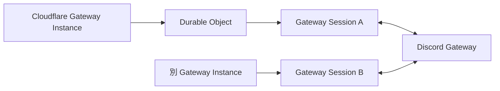

# Cloudflare 取り込みアーキテクチャ（Ingestion）

本ディレクトリでは、Discord Gateway との WebSocket 接続を Cloudflare 上で維持し、受信したイベントを Observation として後続へ安全に引き渡すアーキテクチャを定義する。

## Cloudflare Gateway Instance と Durable Objects

Cloudflare 上で動作する Gateway Instance では、1つの Discord Gateway Session を単一の runtime owner が管理する必要がある。

この Session 単位の所有と再開可能な状態管理を実現するため、Cloudflare 上の Gateway Instance には Durable Objects（DO）を採用する。

DO は「特定 shard を世界で唯一観測する owner」ではない。同じ shard assignment を持つ別 Gateway Instance が、Raspberry Pi や別の Cloudflare instance を含めて並行稼働することを許容する。

各 Session は独立した `session_id` と `sequence` を持ち、Cloudflare 側の DO は自身が所有する Session の状態だけを管理する。

## 再起動と Resume

Durable Objects は、デプロイや内部メンテナンスに伴い再起動する場合がある。

Cloudflare Gateway Instance は、自身の Session を Resume するために必要な最小限の情報を durable に保持する。

再起動後は保存された Session state を利用して Discord への Resume を試行する。

Invalid Session 等により Resume できない場合は、新規 Session を確立し、未取得区間の修復を Backfill へ委譲する。

Cloudflare から別 Gateway Instance への移行では、Cloudflare Session の state を他 Instance へ移植することを前提としない。新しい Instance が独立 Session を確立し、一定期間並行観測した後に旧 Instance を停止する。

## Observation への provenance

Cloudflare Gateway Instance から downstream へ送る Observation には、少なくとも次の関係を後から追跡できる情報を保持する。

* Cloudflare 上の Gateway Instance
* Discord Gateway Session
* shard assignment
* Discord が発行した sequence

同じ Discord 上の出来事を他の Gateway Instance も観測している可能性を正常系として扱う。

## ダウンストリームへの配送とバックプレッシャー

DO が受信した Dispatch イベントは、Observation Archive への durable write path へ非同期に引き渡す。

ストレージの書き込み遅延や一時的な障害が WebSocket 受信ループへ連鎖しないよう failure boundary を設ける。

具体的な Queue topology、batching、retry は Observation Architecture と Infrastructure Design で定義する。

## 分割予定の詳細設計

* **Gateway Runtime Ownership**: 1 Gateway Session を所有する DO のライフサイクル
* **Gateway Instance Identity**: Cloudflare 上の observer identity と shard assignment
* **Session Persistence**: Resume に必要な state の durable boundary
* **Heartbeat Runtime**: heartbeat と liveness の runtime 実装
* **Resume Runtime**: 切断検知から Resume、新規 Session 確立までの状態遷移
* **Multi-instance Handoff**: 新旧 Gateway Instance の並行稼働と停止条件
* **Event Handoff**: Observation Archive への非同期引き渡し
* **Backpressure Strategy**: downstream 遅延時の failure isolation
