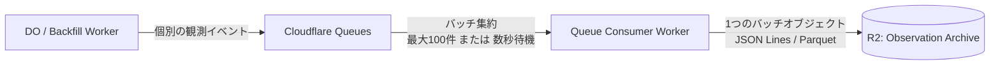

# Cloudflare Observation アーキテクチャ

本ディレクトリでは、Gateway や HTTP Backfill から届いた生の観測事実（Observation）を、Cloudflare R2 上の Observation Archive へ高耐久かつコスト効率よく永続化する書き込みパス（Durable Write Path）のアーキテクチャを扱います。

## R2 永続化とバッチ集約のアーキテクチャ

Observation Archive の基盤として **Cloudflare R2** を採用します。

### Class A 操作コストの抑制とバッチング
Discord 上では 1 秒間に数十〜数百件のイベントが発生することがあります。各イベントを個別の R2 オブジェクトとして都度保存（PUT）すると、R2 の Class A 操作回数が爆発的に増加し、コストおよびレイテンシ面で破綻します。

この問題を解決するため、以下のバッチングパイプラインを構成します。

* **Cloudflare Queues による自動集約**: Queue のバッチコンシューマ機能を利用し、「一定件数（例: 最大100件）」または「一定時間（例: 5〜10秒）」単位でメッセージをまとめて引き渡します。
* **圧縮と複合フォーマット**: まとまったバッチを 1 つのオブジェクト（NDJSON または Parquet 形式、Gzip/Zstd 圧縮）として R2 へ一度に書き込みます。これにより Class A 操作数を数百分の一に削減します。

## 書き込みパスの耐久性保証（Durability First）

* **Canonical 変換からの完全な独立**: Observation の R2 保存処理は、後段の Canonical Store への正規化処理の成否に一切依存させません。Observation が R2 に永続化された時点で、取り込み成功としてコミットします。
* **リトライと重複の許容**: R2 への書き込みに一時的なネットワークエラー等で失敗した場合は、Queue の標準リトライ機能によって自動再試行します。リトライによって同一バッチが重複書き込みされた場合でも、前段のドメイン原則に従い重複を許容し、後段の処理層で排除します。
* **Gateway と Backfill の共通書き込みパイプライン**: リアルタイムイベント（DO）と HTTP 取得データ（Backfill Worker）は、同一の Queue エンドポイントを経由することで、R2 への保存フォーマットとバッチングロジックを完全に共通化します。

## 今後分割する詳細設計

* **Archive Write Path**: Queue Consumer による R2 オブジェクト生成とコミットシーケンス
* **Observation Batching**: 最適なバッチサイズ、待機時間、および圧縮アルゴリズムの選定
* **Object Layout**: R2 内のプレフィックス階層設計（日付・ギルド・時間帯パーティション）
* **Retry & Duplicate Handling**: Queue リトライと DLQ（Dead Letter Queue）の退避ポリシー
