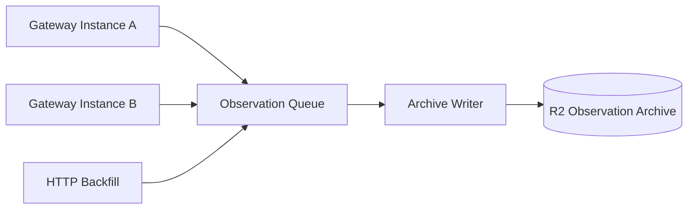

# Cloudflare Observation アーキテクチャ

本ディレクトリでは、複数の Gateway Instance や HTTP Backfill から届いた Observation を、Cloudflare R2 上の Observation Archive へ高耐久かつコスト効率よく永続化する書き込みパスを定義する。

## 複数 Producer を前提とする書き込みパス

Observation Archive への write path は、単一の Gateway runtime を前提にしない。

Cloudflare 上の Gateway Instance、将来の Raspberry Pi 上の Gateway Instance、HTTP Backfill、Reconciliation など、複数の producer が同時に Observation を送信できる構成とする。

共通の write path を通過しても、Gateway Instance、Discord Gateway Session、shard assignment、sequence、Backfill run などの provenance を失ってはならない。

複数 Gateway Session が同じ Discord 上の出来事を並行して観測した場合、write path では無理に一つへ統合せず、それぞれの Observation を保存する。

## R2 永続化とバッチ集約

Observation Archive の物理基盤として Cloudflare R2 を採用する。

大量の小さな object を無条件に生成すると operation 数が増えるため、Observation を一定単位で batch 化して R2 へ保存する。

Batching は保存効率のための infrastructure concern であり、Observation の identity や provenance の境界を変えない。

具体的な batch size、圧縮形式、object format、object layout は詳細設計で確定する。

## Durability First

Observation の R2 保存処理は、後段の Canonical Store への正規化処理の成否に依存させない。

Observation が Archive の durable boundary を越えた後に Canonical processing が失敗しても、保存済み Observation から再処理できることを保証する。

Retry によって同じ source delivery が再送された場合や、複数 Gateway が同じ出来事を観測した場合は重複を許容する。

Queue 自体を source of evidence とせず、Queue の retention や retry 状態を Observation の長期保存保証にしない。

## 分割予定の詳細設計

* **Archive Write Path**: Observation 受理から R2 durable commit までの境界
* **Observation Batching**: batch size、待機時間、圧縮、object format
* **Object Layout**: R2 prefix と replay traversal
* **Multi-producer Provenance**: 複数 Gateway と HTTP producer の provenance 保持
* **Retry & Duplicate Handling**: source-local retry と cross-session duplicate の扱い
