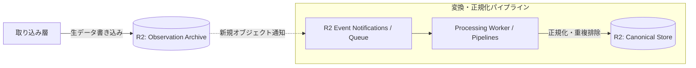

# Cloudflare 処理アーキテクチャ（Processing）

本ディレクトリでは、Observation Archive に蓄積された生データを抽出し、正規化・重複排除・順序解決を行って Canonical Store（Apache Iceberg）へ書き込むデータ処理パイプラインのアーキテクチャを扱います。

## 処理層の分離と障害隔離（Failure Isolation）

本アーキテクチャの最重要原則は、**正規化・変換処理の障害が、前段の Observation Archive への生データ収集を決して止めないこと**です。

* **イベント駆動型の非同期実行**: Observation Archive（R2）に新しいバッチオブジェクトが保存されたことをトリガー（R2 Event Notifications または Queues）として、処理ワーカーを起動します。
* **変換パイプライン停止時の安全弁**: もし正規化コードにバグがあったり、Iceberg カタログへのコミットが失敗した場合、処理ワーカーのみが停止（エラーログ記録と DLQ 退避）します。Observation Archive への生データ書き込みは完全に独立しているため、データ消失は発生しません。修正版コードをデプロイした後、未処理のオブジェクトを安全にリプレイできます。

## 実行モデルと Cloudflare Pipelines の位置づけ

* **マイクロバッチ処理の採用**: リアルタイムな1件ずつのストリーミング処理ではなく、R2 にバッチ保存されたオブジェクト単位（数十〜数百件）で正規化を行うマイクロバッチ処理を採用します。これにより、Iceberg のスナップショット過剰生成を防止します。
* **Cloudflare Pipelines の活用方針**: Cloudflare Pipelines はデータ変換・ストリーム処理の有力な候補ですが、パイプラインの独自機能にアーキテクチャ全体を強くロックインさせません。標準的な Worker + Queue によるフォールバックが常に可能な状態を維持します。

## リプレイ（Replay）と全再構築（Rebuild）の実行モデル

* **増分リプレイ（Incremental Replay）**: 障害発生時やバグ修正時は、R2 のプレフィックス（日付・時間）を指定して未反映の Observation オブジェクト群を再読み込みし、差分のみを Canonical Store へマテリアライズします。
* **一括全再構築（Full Rebuild）**: スキーマ刷新などの大規模改修時は、専用の Rebuild Worker を起動して R2 の全 Observation オブジェクトを並行スキャンし、新しい Iceberg テーブルへゼロからデータを生成します。

## 今後分割する詳細設計

* **Normalization Pipeline**: JSON ペイロードのパース、バリデーション、および型変換の詳細手順
* **Replay Execution**: 過去オブジェクトの指定と順序を保った再投入メカニズム
* **Rebuild Strategy**: 大規模全再構築時の並列処理ワーカーの分散とリソースリミット管理
* **Processing Failure Isolation**: DLQ、リトライ上限、およびアラート発報フロー
