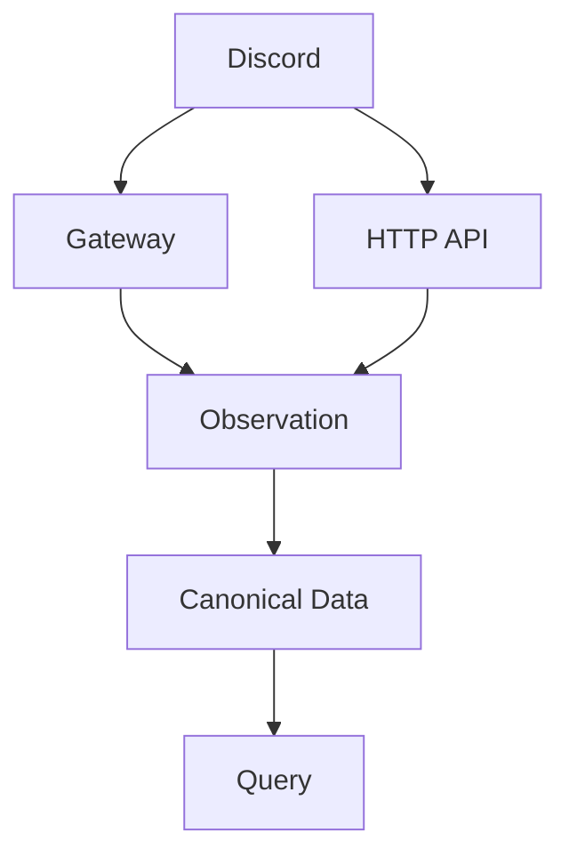

# Domain Design

このディレクトリでは、Discord 向け Data Warehouse としての意味、状態、保証、復旧規則を定義します。

## Domain の境界

このプロジェクトの Domain は Discord に依存します。

そのため、Guild、Channel、Thread、Message、Gateway Session、Sequence、Resume、Heartbeat、Intent、HTTP API、Snowflake ID などの Discord 固有概念は Domain Design に直接含めて構いません。

一方、Durable Objects、Workers、Queues、R2 など、特定 infrastructure の mechanism は Domain Design の主語にしません。

実際の infrastructure 制約を踏まえて Domain requirement が変化することは許容します。その場合は、特定 vendor の実装方法ではなく、DWH が満たすべき制約や保証として表現します。

## Domain 全体像

## Subsystem

- [ingestion/README.md](ingestion/README.md): Gateway から継続的に観測を取得するための意味論
- [observations/README.md](observations/README.md): Observation Archive に保存する観測事実と provenance
- [canonical-store/README.md](canonical-store/README.md): 分析可能な Canonical Data Model
- [backfill/README.md](backfill/README.md): HTTP API による初期取得、欠損回復、reconciliation
- [processing/README.md](processing/README.md): Observation から Canonical Data への変換
- [query/README.md](query/README.md): Current State や履歴をどう問い合わせるか
- [lifecycle/README.md](lifecycle/README.md): retention、削除、長期的なデータ lifecycle

## 不変条件

Observation と Canonical Data の意味を混同しません。

Observation は Discord から実際に得られた evidence を表します。

Canonical Data は Observation から再構築可能な分析用表現とします。

Gateway が正常に動作している場合と HTTP Backfill による回復時では、得られる履歴の完全性が異なることを明示します。

Domain Design は Canonical Store を特定 database の mutable current-state table として前提にしません。
