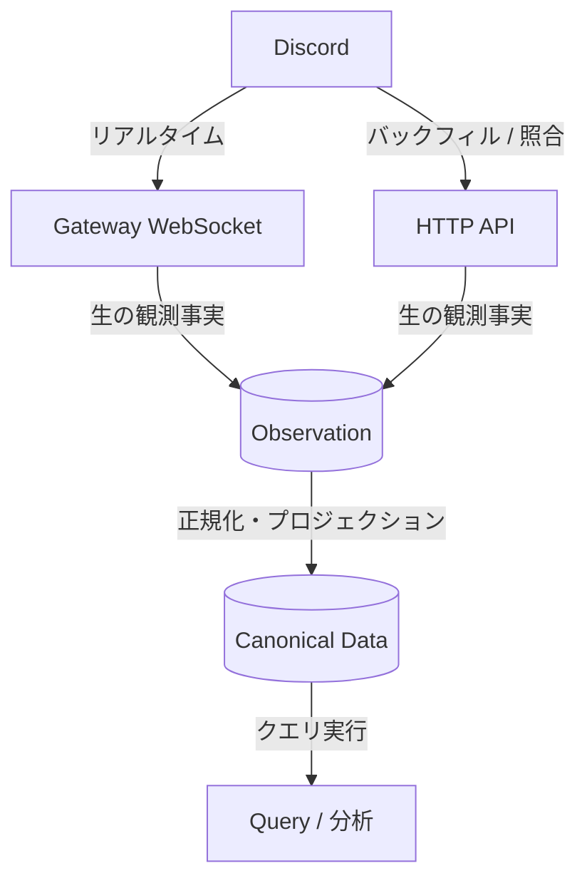

# ドメイン設計

本ディレクトリでは、Discord 向けデータウェアハウス（DWH）としての中核的な意味論、エンティティ定義、状態モデル、データ整合性保証、および復旧規則を定義する。

## ドメインの境界と関心事の分離

本システムのドメインは Discord プラットフォームのプロトコルに依存するため、以下の Discord 固有概念および仕様はドメイン設計に直接含める。

* **プラットフォーム構造**: Guild、Channel、Thread、User、Role、Member
* **データエンティティ**: Message、Attachment、Embed、Reaction、Snowflake ID
* **プロトコル仕様**: Gateway Session、Sequence、Resume、Heartbeat、Dispatch Event、HTTP API

一方で、クラウド基盤固有の実装手段（Durable Objects、Workers、Queues、R2 等）はドメイン設計から完全に排除する。インフラ制約によりドメイン要件が影響を受ける場合であっても、ベンダー固有語彙ではなく「DWH として満たすべき制約および保証」として抽象化して定義する。

## ドメインの全体アーキテクチャ

Discord から発生するデータは、生の観測事実である **Observation** として受理され、分析用に正規化された **Canonical Data** へと変換されたのち、クエリや集計へ提供される。

### Observation と Canonical Data の対比

データ基盤の恒久性を担保するため、ストレージを明確に2層へ分離し、異なる責務と特性を割り当てる。

| 比較観点 | Observation（観測事実） | Canonical Data（正規化モデル） |
| :--- | :--- | :--- |
| **役割** | Discord から観測された「生の事実の証跡」 | クエリ・集計・分析向けに解釈・正規化されたデータ |
| **データの性質** | 追記専用（Append-only）、重複を許容 | 導出データ（Derived）、いつでも再計算可能 |
| **データソース** | Gateway イベントや HTTP レスポンスの生ペイロード | Observation Archive を変換・統合した表現 |
| **耐久性の位置づけ** | **最優先の保護対象**（消失はデータの永久欠損） | Observation が残存していれば任意のタイミングで全再構築可能 |
| **Current State** | 保持しない（発生した事実の時系列ログ） | 観測履歴からのプロジェクション（投影）として導出 |

## サブシステム一覧

ドメイン設計は関心事ごとに以下のサブシステムに分割される。

* [product-policy/](product-policy/README.md): Product Owner が確定した利用目的、認可、Retention / Deletion、収集範囲、State Semantics
* [ingestion/](ingestion/README.md): Gateway からリアルタイムにイベントを受信するためのセッション状態と配送保証
* [observations/](observations/README.md): 取得した生の観測事実、来歴（Provenance）、および重複のセマンティクス
* [canonical-store/](canonical-store/README.md): 長期的なクエリ・分析に適した正規化データモデルとスキーマ進化の原則
* [backfill/](backfill/README.md): HTTP API による過去データの初期取得、Gateway 欠損の補完、定期的なアンチエントロピー照合
* [processing/](processing/README.md): Observation から Canonical Data への正規化、重複排除、順序解決、リプレイ機構
* [query/](query/README.md): 最新状態（Current State）のプロジェクションや時系列履歴への問い合わせセマンティクス
* [lifecycle/](lifecycle/README.md): データの長期保存期間（Retention）、削除要求への対応、スキーマ移行ライフサイクル

## ドメインの基本不変条件

本システムのすべての設計および実装は、以下の基本不変条件を満たさなければならない。

1. **事実と解釈の混同禁止**: Observation（観測事実）と Canonical Data（解釈・正規化表現）の境界を明確に維持し、Canonical Data の生成失敗が Observation の永続化・耐久性に波及してはならない。
2. **Provenance の不変性**: いかなるデータも取得経路および観測時刻を偽ってはならない。HTTP Backfill で取得したメッセージを、観測していない Gateway イベント（`MESSAGE_CREATE` 等）として偽装することを禁じる。
3. **完全性保証の明確な区別**: リアルタイムな中間編集・削除まで観測可能な Gateway 履歴と、取得時点の最新スナップショットしか得られない HTTP Backfill では、復元できる履歴の完全性が本質的に異なることを前提とする。
4. **Current State の非特権化**: Canonical Store は特定データベースの更新可能レコードとして固定化せず、観測履歴から導出可能なプロジェクションとして設計する。
5. **Product Policy の優先**: 収集・利用・保持・削除・認可・State Semantics は [Product Policy](product-policy/README.md) に従い、実装者が技術的都合で再定義してはならない。
6. **Best-known state**: Current / Historical State は Discord の完全な真実ではなく、保存済み Observation から deterministic に導出可能な best-known state とする。
