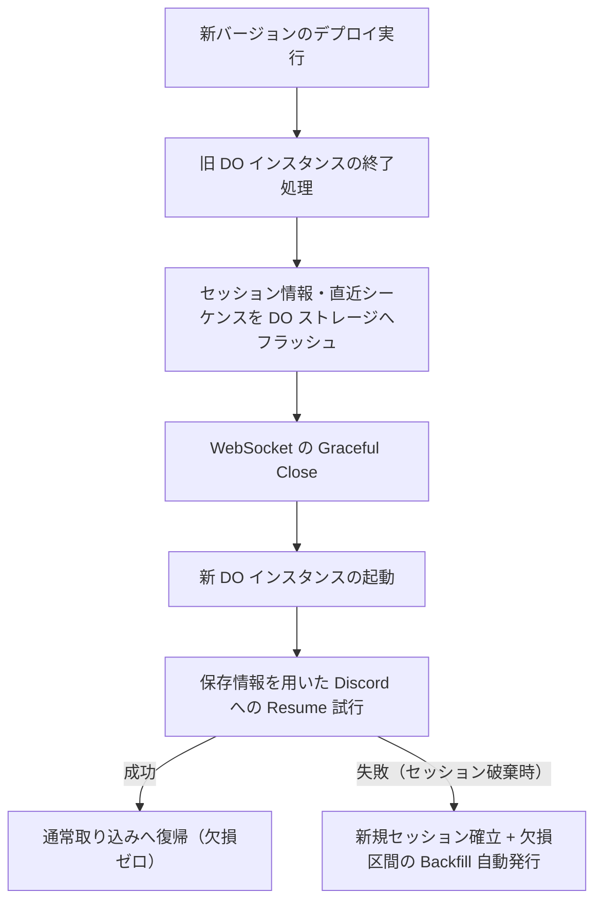

# Cloudflare デプロイ・マイグレーション設計

本ディレクトリでは、Cloudflare 上に配置される各 Worker、Durable Objects、キュー、およびストレージリソースを安全かつ再現可能にデプロイ・移行（マイグレーション）・ロールバックするためのインフラ設計を定義する。

## CI/CD と構成管理（IaC）方針

すべてのリソース構成およびコードのデプロイは、手動操作を排し、Git リポジトリを唯一の正（Source of Truth）とした自動化パイプラインによって実行する。

* **デプロイツール**: Cloudflare 公式の `wrangler` CLI を採用し、環境（`dev` / `beta` / `prod`）ごとの設定を `wrangler.toml`（または環境別設定ファイル）で管理する。
* **CI/CD パイプライン**: GitHub Actions を利用し、テスト実行、環境別ブランチへのマージ、および自動デプロイを統制する。

## デプロイ時のデータ欠損防止原則（Zero Data Loss）

常時接続を維持する Ingestion Worker（Durable Objects）のデプロイにおいては、以下の耐障害機構と連携してデータ欠損を防止する。

* **安全な終了処理**: 新コード反映に伴い DO インスタンスが再生成される際、最新の `session_id` と `sequence` を確実にストレージへ永続化してから接続を切断する。
* **Resume と Backfill の多重防御**: デプロイ直後に新インスタンスが Discord へ `Resume` を要求し、未達イベントを回収する。仮にセッションが失効した場合でも、Backfill パイプラインが直ちに起動して未取得区間を補完する。

## インフラ設計における確定事項

* **ロールバック手順**: デプロイ起因の不具合発生時に、直前の安定バージョンへ安全に切り戻す手順の確立。
* **Durable Object のマイグレーションタグ**: クラス定義や内部ストレージスキーマを変更する際の Wrangler migration 設定。
* **Data Catalog / Iceberg スキーマのバージョン管理**: テーブル変更を適用する際のマイグレーションスクリプトの配置と実行パイプラインの整備。
