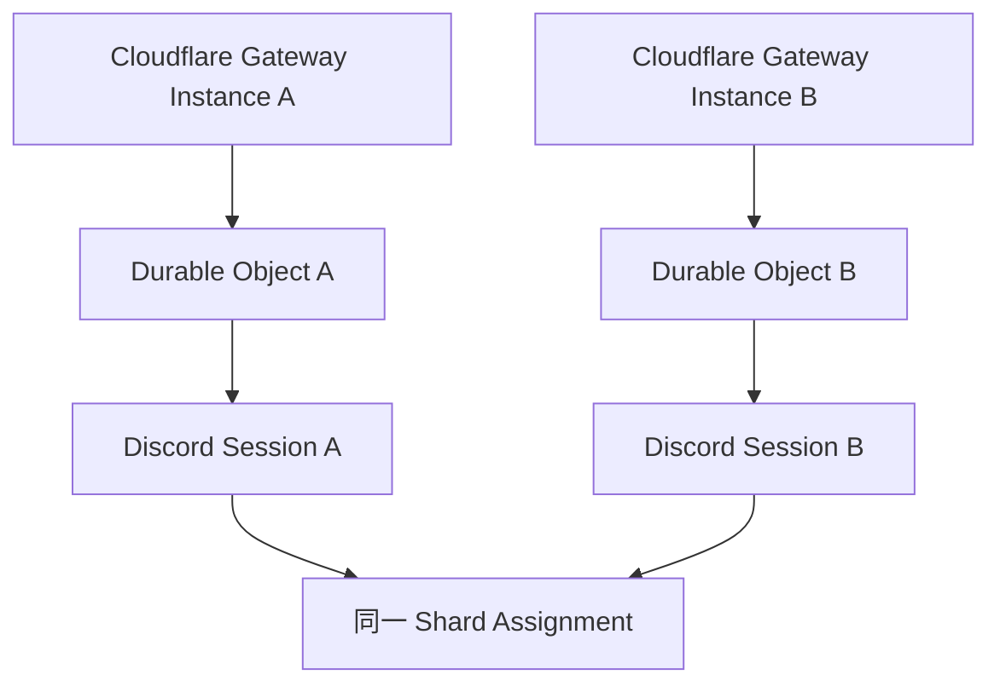

# Cloudflare Durable Objects インフラ設計

本ディレクトリでは、Cloudflare 上の Gateway Instance が所有する Discord Gateway Session を維持するための Durable Objects（DO）のインフラ構成、名前空間、およびキャパシティ設計を定義する。

## 名前空間とインスタンス識別

Durable Object は Discord shard 全体の唯一の owner ではなく、**Cloudflare 上の1つの Gateway Instance が持つ1つの Gateway Session の owner** として扱う。

同じ shard assignment に対して、別 Gateway Instance が並行して存在することを許容する。

そのため DO の instance identity は shard ID だけでは一意化せず、少なくとも Gateway Instance と shard assignment を区別できなければならない。

具体的な instance key format は詳細設計で決定する。

Raspberry Pi など Cloudflare 外の Gateway Instance は、この DO namespace の管理対象ではない。

## Session State

各 DO は自身が所有する Discord Session の Resume に必要な state を保持する。

別 Gateway Instance の Session state を共有したり、Cloudflare から別 runtime への移行時に Session state を移植することは前提としない。

移行時は新 Gateway Instance が独立 Session を開始し、並行観測後に旧 Instance を停止する。

## リソース消費とコスト

Cloudflare 上で常時稼働する Gateway Instance 数に応じて Durable Objects Duration が増加する。

1つの Cloudflare Gateway Instance を常時稼働させる場合のコスト試算は引き続き基準値として利用する。

移行期間に Cloudflare 上で複数 Instance を重ねる場合や、将来 Cloudflare 内で常時冗長化する場合は、Instance 数に応じた追加消費を capacity planning に含める。

Cloudflare 外の Gateway Instance は Durable Objects Duration を消費しない。

## 設計時に確定する事項

* Gateway Instance identity と DO instance key の対応
* Shard assignment との対応
* Session state の永続化境界
* Storage usage
* Liveness mechanism
* Deployment 時の新旧 Instance overlap
* Environment 分離
* Resource monitoring
