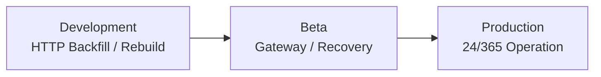

# Cloudflare 環境設計（Environments）

本ディレクトリでは Development、Beta、Production の検証目的と resource isolation を定義する。

## Development

主目的は first-MVP の閉ループを検証すること。

* HTTP Backfill Channel Durable Object と durable progress
* direct R2 Observation Archive
* PyIceberg による Canonical materialization / rebuild
* R2 Data Catalog / R2 SQL query
* Rebuild Acceptance Test

Gateway 常時接続は行わない。

Cloudflare Free の runtime limit が technical spike や materializer の成立性を妨げる場合は、外部 PyIceberg runtime または Workers Paid を使用してよい。Free plan への固執を Product requirement にしない。

## Beta

主目的は Gateway runtime と recovery semantics の実測検証とする。

#18 の outbound WebSocket lifecycle verification を最初に行う。

その後、Received / Accepted Sequence、Resume replay、Session loss、Backfill repair、複数 Gateway Instance、Identify budget coordination を検証する。

## Production

Product Policy の DWH-public scope を対象に 24時間365日の継続 ingestion と Query capability を提供する。

Gateway runtime の安定稼働に必要な plan / runtime は Beta の実測結果に基づいて選定する。

Workers Paid を基準構成とするが、Cloudflare 外 Gateway Instance の併用を禁止しない。

## Environment Isolation

dev / beta / prod で少なくとも以下を分離する。

* Observation / Canonical / Control R2 bucket
* Durable Object namespace
* Discord credential
* Cloudflare deployment credential
* R2 Data Catalog / Canonical namespace

Beta data を Production の Source of Evidence として直接昇格させない。Production 開始時は Product Policy に従う DWH-public scope を改めて ingest する。
