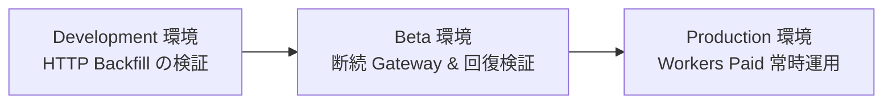

# Cloudflare 環境設計（Environments）

本ディレクトリでは、開発から本番の安定運用に至るまでのフェーズ定義と、Cloudflare 上における環境分離（Development, Beta, Production）のインフラ設計を定義する。

## 想定フェーズと環境の定義

システムの成熟度と検証目的に応じて、以下の 3 環境を定義する。

### 1. 開発環境（Development）
* **主目的**: Discord HTTP API 経由での Backfill 実行、Cloudflare Queues によるバッチ集約、R2 への Observation 保存、および Iceberg へのマテリアライズパイプラインの正常性確認。
* **運用形態**: Gateway の常時接続は行わず、手動トリガーまたは限定的なクロールテストを実行。Free プラン枠内で運用する。

### 2. 検証環境（Beta）
* **主目的**: 断続的な Gateway 接続テスト。WebSocket 接続の安定性、切断時の Resume 動作、セッション失効時の Backfill 自動補完連携の実測および評価。
* **運用形態**: テスト用ギルドを接続し、負荷変動や障害注入（意図的な切断）を実施しつつ、Durable Objects のリソース消費量（GB-s 等）を測定する。

### 3. 本番環境（Production）
* **主目的**: 本番 Discord サーバーにおける全イベントの常時収集、高耐久な長期蓄積、および分析クエリの提供。
* **運用形態**: Workers Paid プランを適用し、24時間365日の連続接続運用を確立する。

## 環境分離における設計論点

本番移行に向け、以下のインフラ分離境界を適用する。

* **リソースの完全分離**: 本番（prod）環境と開発・検証（dev/beta）環境の間で、R2 バケット、Queues、Durable Objects 名前空間を物理的に分離し、テストデータの混入や誤操作による本番影響を構造的に排除する。
* **認証情報の分離**: Discord Bot Token および Cloudflare API トークンを環境ごとに発行し、Wrangler Environments または Cloudflare Secrets で個別管理する。
* **移行ポリシー**: Beta で収集したデータを Production へ直接引き継がず、本番公開時に初期 Backfill を改めて実行するクリーンスタート方針を原則とする。
