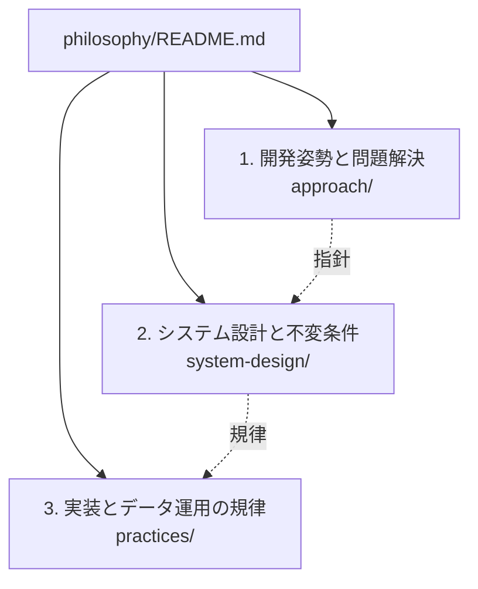

# 設計思想とエンジニアリング原則（Philosophy）

本ディレクトリでは、ソフトウェアの開発および長期的な運用において、特定の技術選定や一時的な実装手法を超えて有効に機能する**設計思想（Philosophy）とエンジニアリング原則**を定義する。本組織（ojiverse）の各リポジトリにおける共通の設計思想基盤として位置づけられる。

各文書は、システム各部への責任（Ownership）割り当て、検証の妥当性評価、および5〜10年に及ぶ運用・進化におけるリポジトリ健全性の維持を目的とした意思決定基盤である。規則の形式的な網羅ではなく、設計判断における客観的基準として機能する。

## 思想の体系と階層構造

思想体系は、抽象度と適用対象に応じて以下の3階層で構造化される。

| 階層 | 格納ディレクトリ | 主な対象と目的 |
| :--- | :--- | :--- |
| **1. 開発姿勢と問題解決** | [approach/](approach/README.md) | 最重要の急所（支配的要因）の見極め、評価基準の先行、人間と機械の協調姿勢 |
| **2. システム設計と不変条件** | [system-design/](system-design/README.md) | 現在の確実性レベル、不変条件、事実源、宣言的収束、疎結合高凝集などの構造原則 |
| **3. 実装とデータ運用の規律** | [practices/](practices/README.md) | 設計としての型、不変性の徹底、コメントの厳選、データソース追加時のセマンティクス保護 |

## 保証の短いパス

すべての原則は、**要件 → 不変条件 → 信頼できる情報源 → 所有するメカニズム → 観測可能な結果・証拠**という最短の検証パスの確立を共通の目的とする。

検証項目を形式的に増大させるのではなく、責任の所在と検証の客観的証拠を確定させることを本質とする。
