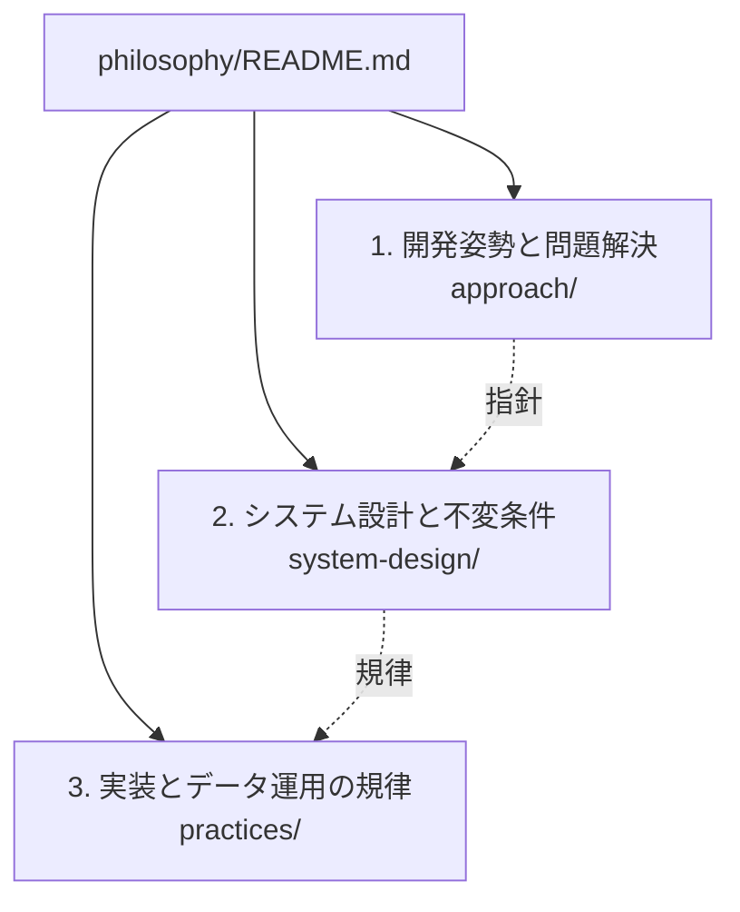

# 設計思想とエンジニアリング原則（Philosophy）

本ディレクトリでは、ソフトウェアの開発および長期的な運用において、特定の技術選定や一時的な実装手法を超えて有効に機能する**設計思想（Philosophy）とエンジニアリング原則**を定義します。本組織（ojiverse）の各リポジトリにおける共通の設計思想基盤として位置づけられます。

これらの文書は、システム各部へ責任（Ownership）をどう割り当て、何を意味のある検証とし、5〜10年に及ぶ進化の中でリポジトリの健全性をどう維持するかを示す意思決定の共通基盤です。単なるルールの網羅ではなく、日々の設計判断における明確な拠り所として機能します。

## 思想の体系と階層構造

本思想体系は、抽象度と適用場面に応じて以下の 3 つの階層に構造化されています。

| 階層 | 格納ディレクトリ | 主な対象と目的 |
| :--- | :--- | :--- |
| **1. 開発姿勢と問題解決** | [approach/](approach/README.md) | 最重要の急所（支配的要因）の見極め、評価基準の先行、人間と機械の協調姿勢 |
| **2. システム設計と不変条件** | [system-design/](system-design/README.md) | 現在の確実性レベル、不変条件、事実源、宣言的収束、疎結合高凝集などの構造原則 |
| **3. 実装とデータ運用の規律** | [practices/](practices/README.md) | 設計としての型、不変性の徹底、コメントの厳選、データソース追加時のセマンティクス保護 |

## 保証の短いパス

すべての原則は、**要件 → 不変条件 → 信頼できる情報源 → 所有するメカニズム → 観測可能な結果・証拠**という短い検証パスを確立することを共通の目標としています。

目的はチェックの数を無目的に増やすことではありません。**どこに責任があり、何がその証拠であるかを曖昧さなく確定させること**です。
